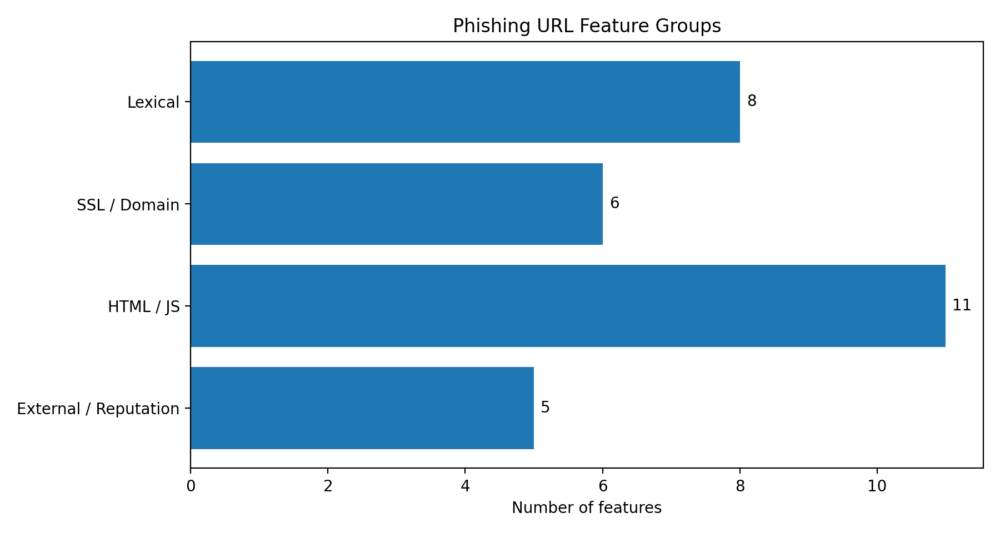
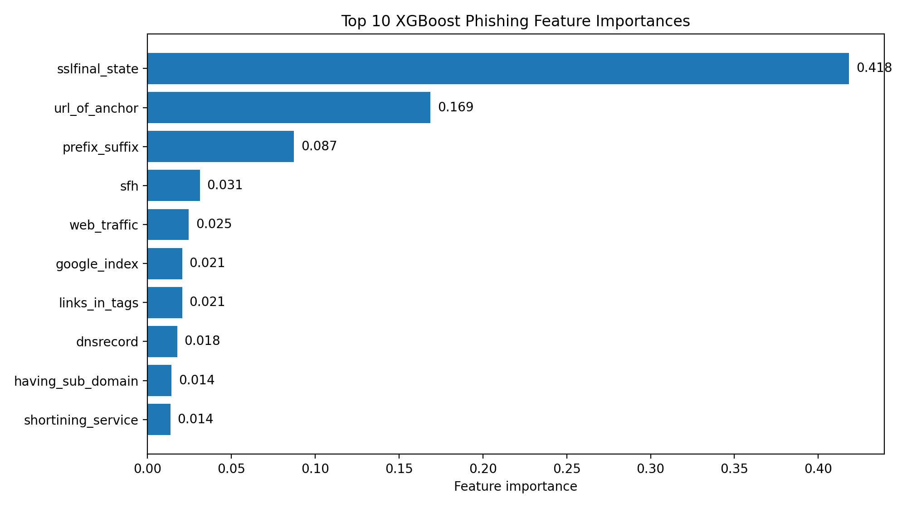
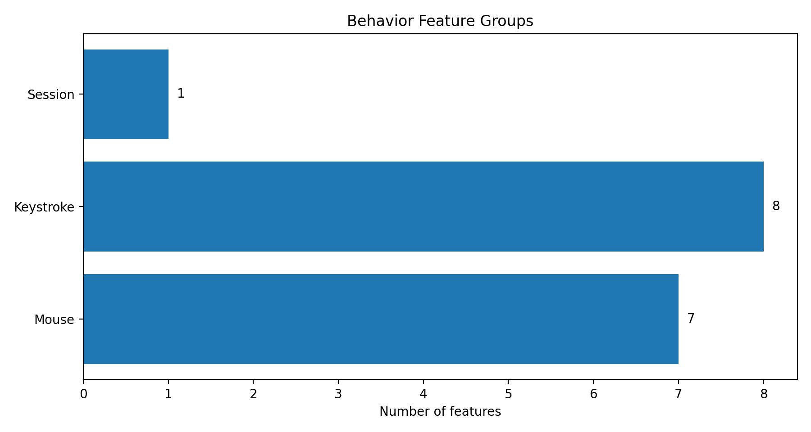
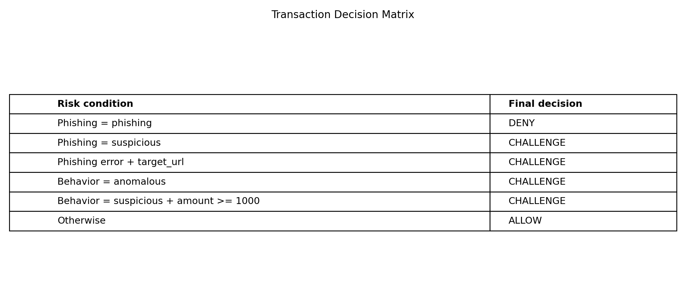
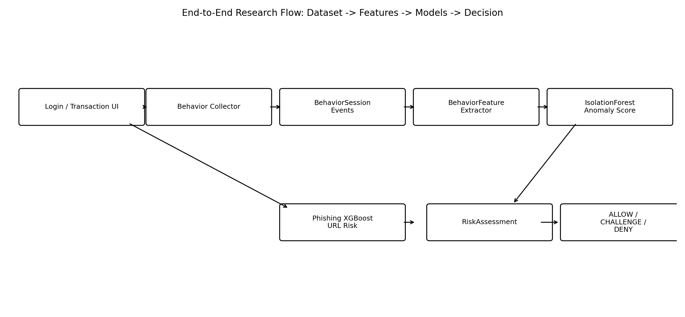

# IV. ТЕСТИРОВАНИЕ И АНАЛИЗ РЕЗУЛЬТАТОВ

## 4.1. Цель и методика тестирования

Целью тестирования является проверка корректности работы разработанной системы аутентификации транзакций на основе phishing-детекции и поведенческого анализа. Поскольку система состоит из нескольких взаимосвязанных подсистем, тестирование проводилось на нескольких уровнях: модульном, интеграционном, API-уровне и уровне пользовательских сценариев.

Основное внимание уделялось проверке следующих аспектов:

- корректность извлечения признаков URL для phishing-модуля;
- устойчивость phishing pipeline к ошибкам отдельных extractor-ов;
- корректность кэширования признаков URL;
- корректность ML-инференса phishing detector-а;
- создание и завершение поведенческих сессий;
- сохранение событий клавиатуры и мыши;
- отсутствие хранения исходных введённых символов;
- извлечение поведенческих признаков;
- работа baseline anomaly detector-а;
- создание транзакций;
- проверка принадлежности `behavior_session_id` текущему пользователю;
- принятие итогового решения `ALLOW`, `CHALLENGE` или `DENY`;
- корректность dashboard endpoint и ограничение доступа к данным текущего пользователя.

Тестирование выполнялось в локальной среде разработки. Backend-тесты запускались с использованием `pytest` и `pytest-django`. Для frontend-части выполнялась production-сборка с помощью `npm run build`, что позволило проверить корректность TypeScript-кода и сборку React-приложения.

Для запуска полного набора backend-тестов использовалась команда:

```bash
cd backend && XDG_CACHE_HOME=/tmp ../.venv/bin/python -m pytest -v
```

Необходимость указания `XDG_CACHE_HOME=/tmp` связана с тем, что отдельные зависимости, используемые при обработке URL, могут создавать cache-файлы. В локальной среде это позволяет избежать ошибок доступа к read-only cache directory.

Для проверки frontend-сборки использовалась команда:

```
cd frontend && npm run build
```

Итоговый результат автоматического тестирования backend-части составил:

```
228 passed
```

Рис. 4.1. Результат запуска backend-тестов

Результат сборки frontend-приложения:

```bash
npm run build: passed
```

Рис. 4.2. Результат сборки frontend-приложения

## 4.2. Проверка phishing detection

Тестирование phishing-модуля было направлено на проверку всех этапов обработки URL: извлечения признаков, работы pipeline, кэширования, применения модели и API-интеграции. Поскольку phishing-модуль содержит сетевые extractor-ы, особое внимание уделялось тому, чтобы тесты не зависели от реальной сети и внешних сервисов. Для этого в тестах использовались mock-объекты и контролируемые ответы.

На уровне extractor-ов проверялись лексические признаки URL, HTML-признаки, SSL-признаки, WHOIS/DNS-признаки и внешние признаки. Для каждого extractor-а тестировались как успешные сценарии, так и edge cases. Например, проверялась обработка пустого URL, неизвестных ключей, ошибок сетевого запроса и некорректных данных.

Pipeline-тесты проверяли, что `URLFeatureExtractor` корректно объединяет результаты нескольких extractor-ов. Отдельно проверялось, что ошибка одного extractor-а не приводит к падению всего pipeline. Если extractor завершался ошибкой или timeout-ом, его признаки оставались в default-значениях, а остальные признаки продолжали использоваться.

Кэширование проверялось через `FeatureCache`. Тесты подтверждали, что признаки сохраняются и извлекаются по нормализованному URL, что отсутствующая запись возвращает `None`, что повреждённая запись не приводит к падению приложения, а изменение версии кэша инвалидирует старые ключи.

Detector-тесты проверяли, что модель загружается корректно, feature vector формируется в стабильном порядке, `predict_proba` вызывается правильно, а вероятность phishing интерпретируется согласно threshold-логике. Также проверялось, что cache hit пропускает повторный запуск pipeline, а cache miss запускает извлечение признаков и сохраняет результат.

API-тесты endpoint-а POST `/api/phishing/check/` проверяли успешную обработку валидного URL, ошибку 400 для невалидного URL, корректную структуру ответа, наличие признаков в response и сохранение результата в `PhishingEvent`.

Пример ручной проверки phishing endpoint:

```bash
curl -X POST http://127.0.0.1:8000/api/phishing/check/ \
  -H "Content-Type: application/json" \
  -d '{"url": "https://example.com/login"}'
```

Пример ответа системы:

```json
{
  "url": "https://example.com/login",
  "probability_phishing": 0.0278,
  "probability_legitimate": 0.9721,
  "decision": "legitimate",
  "from_cache": false,
  "features": {
    "having_ip_address": 1,
    "url_length": 1,
    "shortining_service": 1
  }
}
```

Рис. 4.3. Пример ответа phishing endpoint

Результаты тестирования показали, что phishing-модуль корректно обрабатывает URL, устойчив к частичным ошибкам extractor-ов и может использоваться как независимый компонент оценки риска.

## 4.3. Проверка сбора поведенческих данных

Проверка подсистемы сбора поведенческих данных включала тестирование создания сессий, завершения сессий, batch insert событий клавиатуры и мыши, а также privacy-требований.

Endpoint `POST /api/behavior/sessions/` проверялся в двух режимах: для anonymous-сессий в development/demo режиме и для authenticated user. После добавления настройки `BEHAVIOR_ALLOW_ANONYMOUS_SESSIONS` было проверено, что production-режим может запрещать anonymous-сессии, а авторизованный пользователь автоматически привязывается к создаваемой `BehaviorSession`.

Endpoint завершения сессии проверял, что после вызова `POST /api/behavior/sessions/{session_id}/end/` у сессии устанавливается `ended_at`. Summary endpoint проверял корректность подсчёта количества событий клавиатуры и мыши.

Отдельно тестировалась отправка событий клавиатуры. Проверялось, что валидный batch создаёт записи `KeystrokeEvent`, а невалидный `event_type` приводит к ответу 400. Также проверялось, что исходное поле `key_value` является write-only и не возвращается в API response.

Ключевым privacy-тестом стала проверка того, что raw key value не сохраняется в базе данных. Если frontend передаёт символ, backend сохраняет только `key_value_hash`. Это важно, поскольку поведенческий collector может работать на страницах с чувствительными полями, включая password input.

Проверка событий мыши включала создание `MouseEvent` для движений, кликов и скроллинга. Тесты подтверждали, что события корректно связываются с `BehaviorSession` и учитываются в summary.

Ручная проверка создания сессии выполнялась следующим запросом:

```bash
curl -X POST http://127.0.0.1:8000/api/behavior/sessions/ \
  -H "Content-Type: application/json" \
  -d '{"is_enrollment": true, "context": {"page": "login", "scenario": "manual-test"}}'
```

Пример ответа:

```json
{
  "id": "83bd23b2-3668-4228-aca9-6654adc28349",
  "started_at": "2026-04-23T23:57:48.317031Z",
  "is_enrollment": true,
  "context": {
    "page": "login",
    "scenario": "manual-test"
  }
}
```

После отправки событий клавиатуры и мыши summary endpoint вернул количество сохранённых событий:

```json
{
  "id": "83bd23b2-3668-4228-aca9-6654adc28349",
  "duration_ms": null,
  "keystroke_count": 2,
  "mouse_count": 2,
  "is_enrollment": true
}
```

Рис. 4.4. Пример summary поведенческой сессии

Результаты тестирования подтвердили, что подсистема корректно собирает поведенческие события, соблюдает privacy-требования и предоставляет данные для дальнейшего ML-анализа.

## 4.4. Проверка behavioral anomaly detection

Тестирование поведенческого AI-модуля было направлено на проверку корректности извлечения признаков и работы baseline anomaly detector-а. Поскольку модуль работает с событиями, сохранёнными в базе данных, тесты создавали контролируемые `BehaviorSession`, `KeystrokeEvent` и `MouseEvent`, после чего проверяли значения рассчитанных признаков.

Для пустой сессии проверялось, что extractor возвращает нулевые признаки и не падает. Это важно для ситуаций, когда collector не успел отправить события или пользователь быстро завершил сессию.

Для клавиатурных событий проверялись количество событий, количество `keydown` и `keyup`, средние значения dwell time и flight time, а также стабильность расчёта скорости набора. Для mouse events проверялись количество движений, кликов, скроллинга, длина траектории и скорость движения курсора.

Отдельный тест проверял стабильный порядок feature vector. Это критично для ML-инференса, поскольку модель получает числовой массив, а не словарь с именами признаков. Изменение порядка признаков без переобучения модели может привести к некорректному результату.

`BehaviorAnomalyDetector` тестировался в двух состояниях: обученном и необученном. В обученном состоянии detector должен принимать список feature vectors, выполнять `fit` и возвращать результат `predict`. В необученном состоянии detector не должен падать. Вместо этого он возвращает безопасный результат `suspicious`, который может привести к дополнительной проверке транзакции.

Результаты тестирования показали, что behavioral AI-модуль корректно преобразует поведенческие события в признаки и предоставляет единый интерфейс для оценки аномальности. Это позволяет использовать его в transaction decision flow.

## 4.5. Проверка принятия решения по транзакции

Тестирование transaction flow было направлено на проверку того, что итоговое решение по операции корректно учитывает phishing-риск, behavior-риск, сумму транзакции и принадлежность поведенческой сессии текущему пользователю.

Endpoint `POST /api/transactions/attempts/` требует аутентификации. Тесты подтвердили, что anonymous user не может создать transaction attempt. Для авторизованного пользователя проверялось успешное создание транзакции и возврат структурированного response.

Отдельно проверялось, что пользователь не может передать `behavior_session_id`, принадлежащий другому пользователю. Это важное security-требование, поскольку иначе злоумышленник мог бы попытаться использовать чужую нормальную сессию для снижения risk score.

Decision matrix тестировалась с использованием mock-результатов phishing и behavior analysis. Это позволило изолировать transaction logic и проверить конкретные сценарии:

- phishing decision phishing приводит к DENY;
- phishing decision suspicious приводит к CHALLENGE;
- ошибка phishing-check при наличии target_url приводит к CHALLENGE;
- behavior decision anomalous приводит к CHALLENGE;
- behavior decision suspicious при сумме >= 1000.00 приводит к CHALLENGE;
- при отсутствии риск-факторов система возвращает ALLOW.

Пример decision matrix показан в таблице 4.1.

Таблица 4.1. Проверяемые сценарии принятия решения

| Сценарий                                              | Ожидаемый результат |
| ----------------------------------------------------- | ------------------- |
| Легитимный URL, нормальное поведение, небольшая сумма | `ALLOW`             |
| Suspicious URL                                        | `CHALLENGE`         |
| Phishing URL                                          | `DENY`              |
| Аномальное поведение                                  | `CHALLENGE`         |
| Suspicious behavior и сумма выше порога               | `CHALLENGE`         |
| Ошибка phishing-сервиса при наличии URL               | `CHALLENGE`         |

Frontend-страница транзакции была проверена через production build. Она отображает итоговое решение, phishing-блок, behavior-блок и список reasons. Это позволяет пользователю и исследователю понять, какие факторы повлияли на результат.

Рис. 4.5. Пример результата анализа транзакции

## 4.6. Исследовательские графики и анализ признаков



Рисунок показывает, как признаки phishing-модуля распределены по основным группам: lexical, SSL/domain, HTML/JS и external/reputation. Такое разделение важно для исследования, поскольку phishing detection не опирается только на один очевидный признак URL, а объединяет несколько источников информации о web-ресурсе.

Для реализованной системы этот график связан с `URLFeatures` и extractor pipeline. Он показывает, какие группы признаков формируются backend-модулем перед передачей feature vector в XGBoost detector.



Рисунок показывает десять наиболее значимых признаков phishing-модели по значениям `feature_importances_` из сохранённого XGBoost artifact. Он важен для интерпретируемости исследования, поскольку позволяет увидеть, какие признаки сильнее всего влияли на классификацию URL в обученной модели.

В реализованной системе эта фигура связана с phishing detector-ом, который загружает model artifact и использует тот же набор признаков при inference. Поэтому график объясняет не только структуру признаков, но и вклад отдельных признаков в практическое решение `legitimate`, `suspicious` или `phishing`.



Рисунок отражает распределение поведенческих признаков по группам Session, Keystroke и Mouse. Он показывает, что behavioral analysis строится не на raw-событиях, а на агрегированных характеристиках сессии, включая длительность, ритм набора и динамику движения мыши.

Для системы этот график связан с модулем извлечения `BehaviorFeatures`. Именно такие признаки формируются из `BehaviorSession`, `KeystrokeEvent` и `MouseEvent`, после чего могут использоваться detector-ом аномалий при оценке поведения пользователя во время транзакции.



Рисунок показывает правила, по которым transaction risk engine преобразует результаты phishing detection и behavioral analysis в итоговое решение `ALLOW`, `CHALLENGE` или `DENY`. Он важен для исследования, поскольку демонстрирует объяснимый risk-based подход вместо непрозрачного бинарного решения.

В реализованной системе эта матрица соответствует логике transaction flow: высокий phishing-риск блокирует операцию, подозрительные факторы приводят к дополнительной проверке, а отсутствие риск-факторов позволяет выполнить транзакцию. Это связывает ML-компоненты с прикладным механизмом аутентификации операции.



Рисунок показывает полный путь обработки: от действий пользователя во frontend до сбора поведенческих событий, проверки URL, анализа риска и сохранения результата для аудита. Он важен как итоговая исследовательская схема, поскольку объединяет отдельные модули в единый end-to-end процесс.

Для реализованной системы эта фигура связывает frontend collector, Django REST API, phishing pipeline, behavioral AI и transaction risk engine. Она показывает, что прототип реализует не изолированные алгоритмы, а полный сценарий принятия решения по транзакции.

## 4.7. Анализ результатов

Результаты тестирования показывают, что разработанная система выполняет поставленные функциональные задачи. Backend-тесты охватывают phishing-модуль, behavior collection, behavioral AI, transaction flow, API и privacy-ограничения. Полный набор тестов завершился результатом `228 passed`, что подтверждает отсутствие регресса между подсистемами.

Phishing-модуль показал корректную работу pipeline и устойчивость к ошибкам отдельных extractor-ов. Это важно, поскольку часть признаков зависит от сетевых запросов и внешних источников. Использование cache позволяет уменьшить стоимость повторных проверок.

Подсистема сбора поведенческих данных корректно сохраняет события и не хранит исходные введённые символы. Это подтверждает, что privacy-требование было учтено не только на уровне архитектуры, но и на уровне тестов.

Behavioral AI-модуль успешно преобразует события в числовые признаки и предоставляет baseline anomaly detection. Хотя текущая модель не является полноценно обученной персональной моделью пользователя, она демонстрирует принцип использования поведенческих признаков в risk-based аутентификации.

Transaction flow объединяет phishing-риск и behavior-риск в итоговом решении. Это является основным результатом практической части работы: система не просто собирает данные и не просто классифицирует URL, а использует оба сигнала для принятия решения по критической операции.

Frontend и dashboard позволяют продемонстрировать работу системы визуально. Через dashboard можно увидеть поведенческие сессии, события и phishing checks. Через transaction page можно выполнить операцию и получить итоговый risk decision.

## 4.8. Ограничения системы и возможные направления развития

Несмотря на успешную реализацию основного flow, система имеет ряд ограничений. Первое ограничение связано с поведенческой моделью. В текущей реализации используется baseline Isolation Forest без полноценного persisted per-user model artifact. Для промышленного применения необходимо обучать и хранить индивидуальные модели поведения пользователя, а также регулярно обновлять их по мере изменения привычек.

Второе ограничение связано с количеством данных. Для качественного поведенческого анализа требуется значительный набор сессий каждого пользователя. В демонстрационном прототипе таких данных недостаточно, поэтому оценка аномальности используется скорее как архитектурный proof of concept, чем как готовая промышленная модель.

Третье ограничение связано с frontend collector-ом. Поскольку collector работает в браузере, злоумышленник теоретически может попытаться отключить его, изменить отправляемые события или имитировать нормальную активность. Для production-системы необходимы дополнительные меры защиты: integrity checks, server-side correlation, device fingerprinting и анализ невозможных или подозрительно идеальных паттернов.

Четвёртое ограничение касается phishing-модели. Модель зависит от качества dataset-а и актуальности признаков. Phishing-атаки быстро меняются, поэтому в реальной системе требуется регулярное обновление обучающей выборки, мониторинг качества модели и поддержка новых источников репутационных данных.

Пятое ограничение связано с decision matrix. Текущие правила являются объяснимым baseline и подходят для дипломного прототипа, однако в промышленной системе может потребоваться более сложный risk scoring, учитывающий историю пользователя, устройство, геолокацию, получателя, частоту операций, сумму и другие признаки.

Возможные направления развития системы включают:

- обучение персонализированных моделей поведения для каждого пользователя;
- хранение и версионирование model artifacts;
- добавление enrollment-периода для накопления нормальных сессий;
- интеграцию с MFA/OTP для сценариев CHALLENGE;
- расширение phishing dataset и регулярное переобучение XGBoost-модели;
- добавление графиков ROC-AUC, FAR, FRR и confusion matrix;
- защиту frontend collector-а от tampering;
- внедрение более сложной модели risk scoring;
- расширение dashboard для анализа инцидентов;
- подготовку production-like deployment сценария.

Таким образом, разработанная система является исследовательским прототипом, демонстрирующим практическую применимость гибридного подхода к аутентификации транзакций. Она показывает, как phishing detection и behavioral AI могут быть объединены в едином risk engine, который принимает объяснимое решение по критической пользовательской операции.

## 4.9. Выводы по главе

В четвёртой главе были рассмотрены тестирование и анализ результатов разработанной системы. Были проверены phishing detection, сбор поведенческих событий, behavioral anomaly detection, transaction decision flow, frontend-сборка и privacy-ограничения.

Автоматическое тестирование подтвердило корректность работы основных подсистем. Полный backend test suite завершился результатом `228 passed`, а frontend-приложение успешно прошло production build. Это свидетельствует о стабильности текущей реализации и отсутствии очевидных регрессий между модулями.

Проверка пользовательских сценариев показала, что система реализует полный end-to-end flow: пользователь входит в приложение, поведенческие события собираются, phishing-риск оценивается, поведенческие признаки анализируются, транзакция получает итоговое решение, а результаты сохраняются для аудита.

Были также определены ограничения системы, связанные с baseline-характером поведенческой модели, недостатком реальных данных, необходимостью защиты collector-а и потребностью в более сложном risk scoring для production-среды. Эти ограничения не отменяют практическую ценность прототипа, но определяют направления дальнейшего развития.

Таким образом, результаты тестирования подтверждают достижение основной цели практической части работы: разработана система, объединяющая phishing detection и behavioral AI для оценки риска транзакций и демонстрирующая возможность применения такого подхода в web-приложениях.
