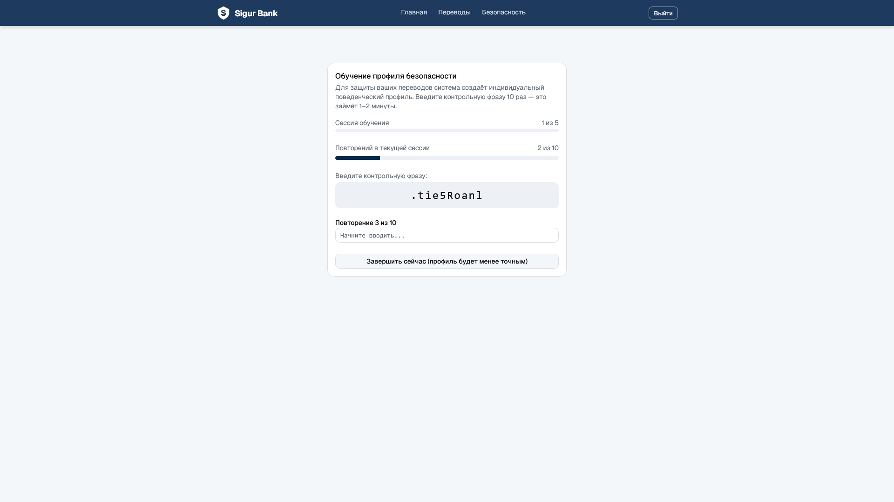
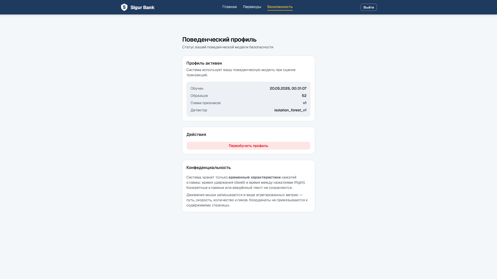
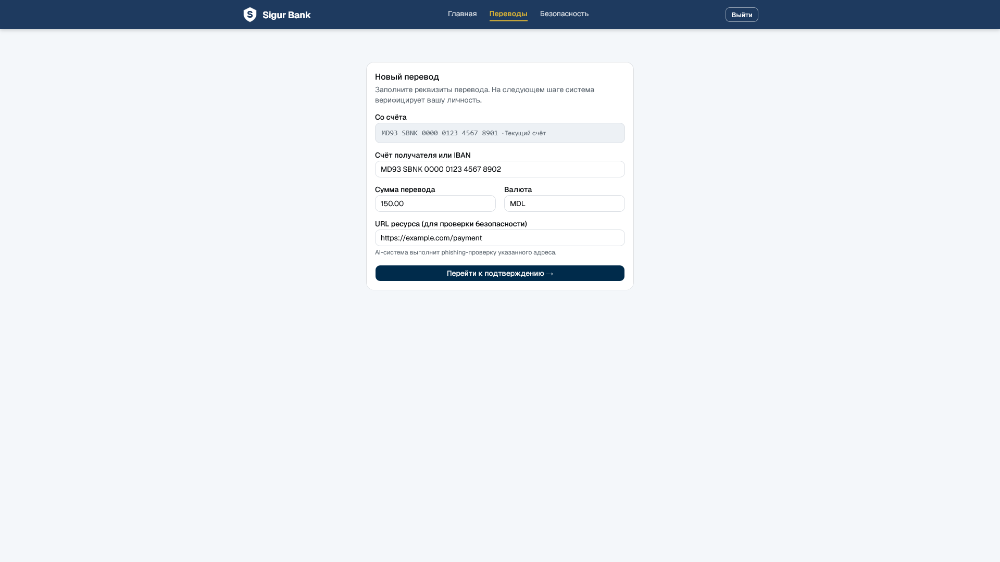
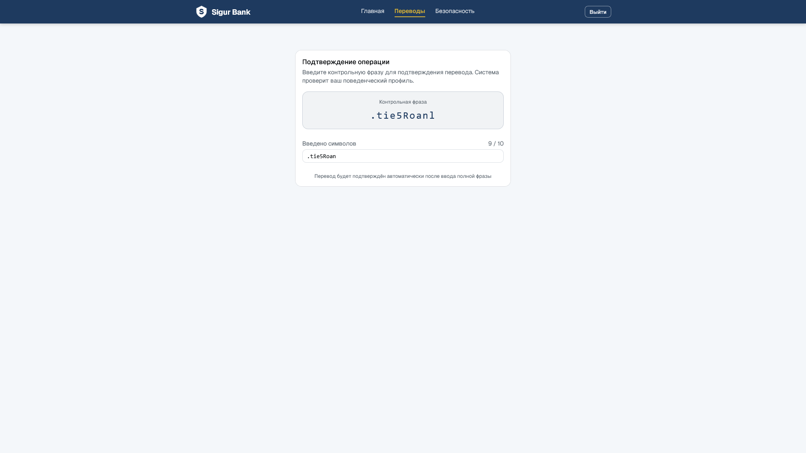
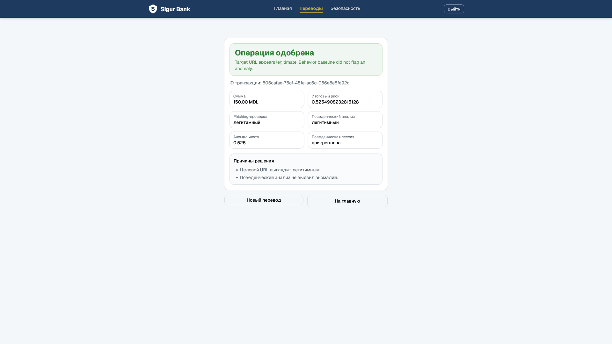
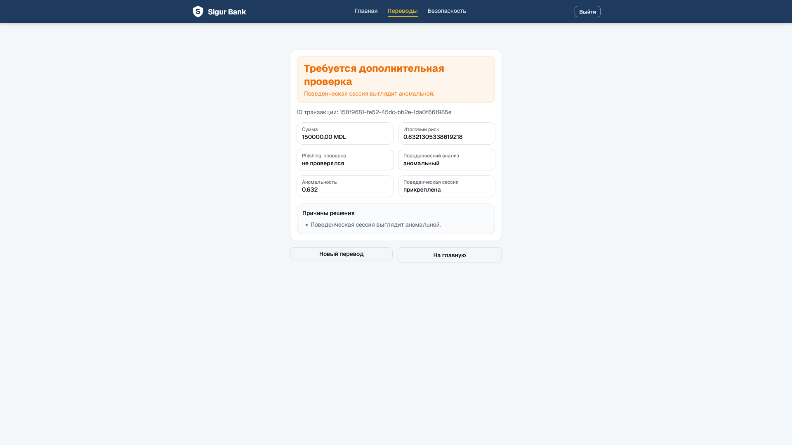
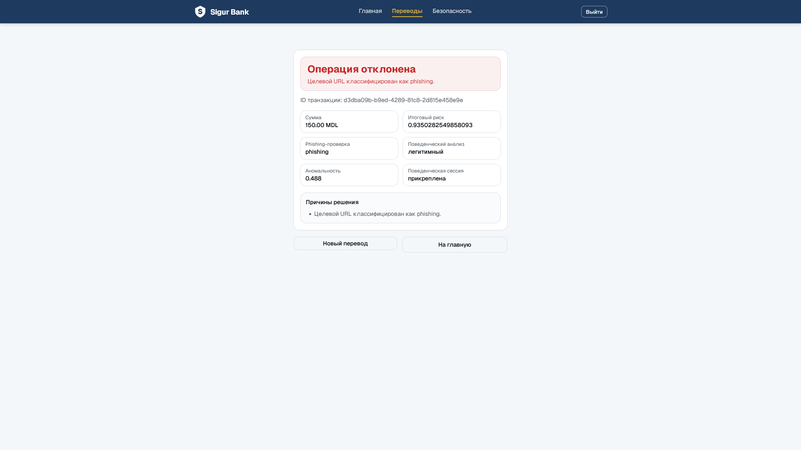
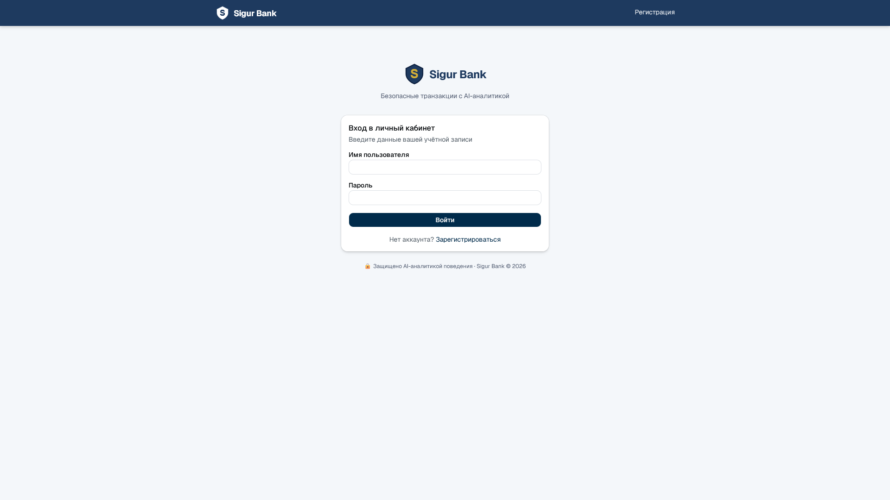
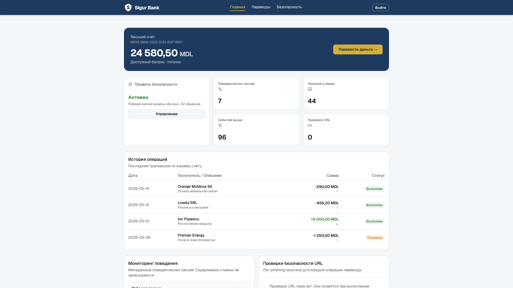
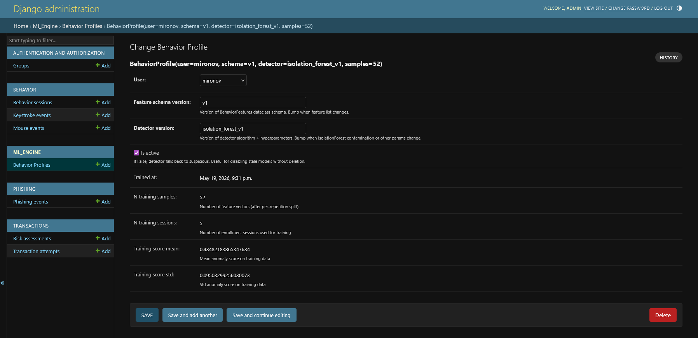

# III. РЕАЛИЗАЦИЯ ПРОГРАММНОГО ПРОДУКТА

## 3.1. Структура программного проекта

Программная реализация разработанной системы выполнена в виде web-приложения, состоящего из backend-части, frontend-части и вспомогательных ML-компонентов. Backend отвечает за хранение данных, REST API, бизнес-логику, интеграцию с ML-моделями и принятие решения по транзакции. Frontend обеспечивает пользовательский интерфейс, сбор поведенческих событий и отображение результатов анализа.

Структура проекта разделена на несколько логических областей. Backend-приложение содержит отдельные Django apps, каждая из которых отвечает за собственную предметную область: аутентификацию, поведенческие данные, phishing-анализ, ML-логику и транзакции. Такой подход упрощает сопровождение проекта и соответствует принципу разделения ответственности.

Основные backend-модули проекта:

- `accounts` — регистрация, вход пользователя и auth API;
- `behavior` — поведенческие сессии, события клавиатуры и мыши, dashboard endpoint;
- `phishing` — извлечение признаков URL, phishing detector, cache, API и audit log;
- `ml_engine` — извлечение поведенческих признаков, обучение персональных моделей, инференс, хранение `BehaviorProfile` и `EvaluationDataset`;
- `transactions` — создание транзакций, оценка риска и сохранение `RiskAssessment`;
- `config` — настройки Django, routing и конфигурация окружения.

Frontend-часть реализована на React и TypeScript. Она содержит страницы входа, enrollment, dashboard и форму транзакции. Отдельные service-модули отвечают за обращение к backend API, а collector фиксирует события клавиатуры и мыши и отправляет их на сервер.

## 3.2. Реализация phishing-модуля

Phishing-модуль реализует полный цикл проверки URL-адреса: извлечение признаков, кэширование, применение ML-модели, формирование решения и сохранение результата в журнале аудита. Основной целью данного модуля является определение вероятности того, что URL, связанный с пользовательской операцией, является phishing-ресурсом.

В основе модуля находится структура `URLFeatures`, описывающая набор признаков, совместимых с phishing-моделью. Признаки собираются несколькими extractor-ами, каждый из которых отвечает за отдельную группу характеристик URL. Лексический extractor анализирует структуру URL без сетевых запросов. SSL extractor проверяет состояние HTTPS-соединения. WHOIS extractor получает доменные признаки. HTML extractor анализирует содержимое страницы. External extractor использует внешние или локальные источники репутационных данных.

Для объединения extractor-ов используется `URLFeatureExtractor`. Он запускает лексический extractor первым, а более дорогие сетевые extractor-ы выполняет параллельно. Такой подход уменьшает время обработки и позволяет системе продолжать работу даже в случае ошибки отдельного extractor-а. Если один источник данных недоступен, соответствующие признаки остаются в значениях по умолчанию, а pipeline возвращает частичный, но валидный результат.

Для уменьшения повторных сетевых проверок реализован `FeatureCache`. Ключ кэша строится на основе нормализованного URL и версии структуры признаков. Это позволяет повторно использовать уже извлечённые признаки и одновременно безопасно инвалидировать старые записи при изменении формата данных.

ML-инференс выполняется в `XGBoostPhishingDetector`. Detector загружает model artifact из пути, заданного через `PHISHING_MODEL_PATH`, преобразует `URLFeatures` в feature vector и вызывает `predict_proba`. На основе вероятности phishing-класса формируется decision: `legitimate`, `suspicious` или `phishing`.

Endpoint `POST /api/phishing/check/` предоставляет внешний API для проверки URL. View валидирует запрос через serializer, вызывает service layer и возвращает структурированный ответ. Результат сохраняется в `PhishingEvent`, что позволяет просматривать историю проверок и использовать её в dashboard или admin.

## 3.3. Реализация сбора поведенческих событий

Сбор поведенческих данных реализован через отдельный Django app `behavior`. Backend предоставляет API для создания поведенческой сессии, завершения сессии, отправки событий клавиатуры, отправки событий мыши и получения краткой статистики.

Модель `BehaviorSession` представляет период взаимодействия пользователя с приложением. Она может быть связана с авторизованным пользователем, а в development/demo режиме допускается создание anonymous-сессий для pre-auth сценариев. Возможность anonymous-сессий управляется настройкой `BEHAVIOR_ALLOW_ANONYMOUS_SESSIONS`.

События клавиатуры сохраняются в модели `KeystrokeEvent`. При этом исходный символ, введённый пользователем, не хранится. Если frontend передаёт `key_value`, backend сохраняет только `key_value_hash`. Это решение снижает риск утечки чувствительных данных и соответствует принципу минимизации данных.

События мыши сохраняются в модели `MouseEvent`. Они включают тип события, координаты, кнопку мыши, параметры скроллинга и временные метки. Эти данные позволяют впоследствии вычислять длину траектории, скорость движения и другие признаки.

Batch creation событий вынесен в `BehaviorEventService`. View отвечает только за HTTP-слой, serializer — за валидацию, service — за создание записей. Такое разделение делает код проще для тестирования и сопровождения.

## 3.4. Реализация behavioral AI-модуля

Поведенческий AI-модуль реализован в приложении `ml_engine`. Приложение отвечает не за хранение сырых событий (это задача `behavior`), а за аналитику: преобразование событий в признаки, обучение персональных моделей, их хранение и инференс при проверке транзакций. Разделение по app-ам соответствует принципу единственной ответственности и упрощает независимое развитие коллекции и аналитики.

**Структура модуля.** Приложение `ml_engine` содержит следующие файлы:

- `behavior_features.py` — классы `BehaviorFeatures` и `BehaviorFeatureExtractor`;
- `behavior_detectors.py` — класс `BehaviorAnomalyDetector` и dataclass `BehaviorAnomalyResult`;
- `training.py` — класс `BehaviorProfileTrainer`, dataclass `TrainingResult`, константы версий;
- `models.py` — Django-модели `BehaviorProfile`, `EvaluationDataset`, `EvaluationSubject`;
- `views.py` — API views для train, status и delete операций;
- `urls.py` — routing для `/api/ml/` prefix;
- `evaluation.py` — логика cross-user evaluation на benchmark datasets.

**Реализация извлечения признаков.** Класс `BehaviorFeatureExtractor` реализует два публичных метода. Метод `extract(session: BehaviorSession) -> BehaviorFeatures` загружает все события сессии из базы данных и возвращает единый агрегированный вектор. Он применяется при инференсе — когда нужно оценить текущее поведение пользователя.

Метод `extract_repetitions(session: BehaviorSession) -> list[BehaviorFeatures]` предназначен для training-режима. Он вызывает вспомогательный метод `_detect_repetition_boundaries()`, который определяет границы повторений контрольной фразы внутри сессии, а затем вычисляет отдельный `BehaviorFeatures` для каждого обнаруженного повторения.

Алгоритм `_detect_repetition_boundaries()` анализирует временны́е интервалы (gaps) между последовательными событиями `keyup`. Реализация метода `_compute_adaptive_gap_threshold()` вычисляет пороговое значение по формуле Tukey's fence:

```
threshold = median(gaps) + TUKEY_FENCE_MULTIPLIER × IQR(gaps)
```

где `TUKEY_FENCE_MULTIPLIER = 3`, а `IQR` — межквартильный размах. Минимальный порог ограничен снизу константой `MIN_GAP_THRESHOLD_MS = 400` мс. Если сессия содержит менее `MIN_KEYSTROKES_FOR_SPLITTING = 15` нажатий, разбиение не выполняется и вся сессия рассматривается как единое повторение. Итоговый список `list[tuple[int, int]]` содержит индексы начала и конца каждого повторения в массиве событий.

Приватный метод `_extract_features_from_events()` принимает срез событий и длительность в миллисекундах, вычисляет все 16 полей `BehaviorFeatures` и возвращает заполненный неизменяемый объект. Для событий мыши отдельный метод `_mouse_movement_features()` вычисляет суммарную длину траектории как сумму евклидовых расстояний между последовательными позициями, среднюю скорость и максимальную скорость движения курсора.

**Реализация модели `BehaviorProfile`.** Django-модель `BehaviorProfile` объявлена в `models.py` и содержит следующие поля:

- `user` — `OneToOneField` к `AUTH_USER_MODEL` с `on_delete=CASCADE`;
- `model_blob` — `BinaryField` для хранения сериализованной Isolation Forest;
- `feature_schema_version` — `CharField` с текущим значением `"v1"`;
- `detector_version` — `CharField` с текущим значением `"isolation_forest_v1"`;
- `trained_at` — `DateTimeField(auto_now=True)`, автоматически обновляется при сохранении;
- `n_training_sessions` — `IntegerField`, количество enrollment-сессий;
- `n_training_samples` — `IntegerField`, количество feature vectors после разбиения;
- `training_score_mean`, `training_score_std` — `FloatField`, диагностические метрики;
- `is_active` — `BooleanField`, позволяет отключить устаревший профиль без удаления.

Связь через `OneToOneField` гарантирует, что у каждого пользователя существует не более одного профиля. При переобучении профиль заменяется атомарно через `update_or_create`.

**Реализация `BehaviorProfileTrainer`.** Класс `BehaviorProfileTrainer` в `training.py` содержит метод `train(user) -> TrainingResult`, который реализует следующую последовательность:

1. `_collect_enrollment_sessions(user)` — выбирает из базы данных все завершённые сессии с `is_enrollment=True`, отсортированные по дате начала.
2. `_extract_all_features(sessions)` — для каждой сессии вызывает `BehaviorFeatureExtractor().extract_repetitions()` и объединяет результаты в единый список. Ошибки при обработке отдельных сессий логируются и пропускаются, не прерывая процесс.
3. Проверка порогов: если количество сессий меньше `MIN_ENROLLMENT_SESSIONS = 5` или количество векторов меньше `MIN_TRAINING_SAMPLES = 50`, метод возвращает `TrainingResult(success=False, error=...)` без обращения к sklearn.
4. `_fit_isolation_forest(feature_vectors)` — создаёт `IsolationForest(contamination=0.1, n_estimators=100, random_state=42)`, вызывает `fit()` на матрице векторов, после чего вычисляет mean и std аномальных оценок на обучающей выборке через `score_samples()`.
5. `_serialize_model(model)` — использует `joblib.dump()` в `io.BytesIO()` буфер и возвращает байты для записи в `model_blob`.
6. Атомарное сохранение через `BehaviorProfile.objects.update_or_create(user=user, defaults={...})` внутри `transaction.atomic()`. Если профиль существует — заменяется; если нет — создаётся новый.

Статический метод `deserialize_model(model_blob: bytes | memoryview) -> IsolationForest` выполняет обратную операцию: создаёт `io.BytesIO` из blob и загружает модель через `joblib.load()`. Он вызывается из `BehaviorAnomalyDetector.from_user_profile()`.

**Реализация `BehaviorAnomalyDetector`.** Класс `BehaviorAnomalyDetector` в `behavior_detectors.py` принимает в конструкторе опциональный объект `IsolationForest`. Если модель передана, детектор считается настроенным (`_is_fitted=True`); если нет — создаётся новый нефиксированный экземпляр (`_is_fitted=False`).

Метод класса `from_user_profile(user) -> BehaviorAnomalyDetector` реализует следующую логику:

```python
profile = BehaviorProfile.objects.filter(user=user, is_active=True).first()
```

Если профиль не найден или отключён (`is_active=False`), возвращается ненастроенный детектор. Далее проверяются версии: если `profile.feature_schema_version != FEATURE_SCHEMA_VERSION` или `profile.detector_version != DETECTOR_VERSION`, то модель несовместима с текущей реализацией и также возвращается ненастроенный детектор с предупреждением в лог. Только при полном совпадении версий выполняется десериализация через `BehaviorProfileTrainer.deserialize_model(profile.model_blob)` и возвращается настроенный детектор.

Метод `predict(features: BehaviorFeatures) -> BehaviorAnomalyResult` обрабатывает оба состояния детектора:

- **Ненастроенный**: возвращает `BehaviorAnomalyResult(anomaly_score=0.0, is_anomaly=False, decision="suspicious")`. Это cold start поведение — осторожная оценка при отсутствии обученного профиля.
- **Настроенный**: вызывает `model.predict([features.to_vector()])`, интерпретирует `-1` как аномалию и возвращает `decision="anomalous"` или `decision="legitimate"`.

Метод `score(features)` возвращает скалярную оценку аномальности через `model.score_samples()` со знаком минус (чем выше значение, тем выше аномальность).

**API endpoints.** Модуль предоставляет три REST endpoint-а:

- `POST /api/ml/behavior-profile/train/` — запускает `BehaviorProfileTrainer().train(request.user)` и возвращает `TrainingResult` в сериализованном виде. Требует аутентификации.
- `GET /api/ml/behavior-profile/status/` — возвращает информацию о текущем `BehaviorProfile` пользователя: версии, количество сессий, количество векторов, дату обучения и флаг активности. Если профиля нет — возвращает `{"trained": false}`.
- `DELETE /api/ml/behavior-profile/` — деактивирует или удаляет профиль пользователя.

**Модели для benchmark evaluation.** Для экспериментальной валидации на датасете CMU Keystroke Dynamics реализованы дополнительные Django-модели. `EvaluationDataset` хранит метаданные набора данных (название, описание, URL источника). `EvaluationSubject` хранит векторы признаков одного субъекта в виде JSON-массива (`feature_vectors: JSONField`), а также дополнительные metadata. Связь с `EvaluationDataset` реализована через `ForeignKey`. Эти модели изолированы от production-данных пользователей: `EvaluationSubject` не является Django User и не имеет с ним связей.

Рисунок 3.1 демонстрирует процесс enrollment в действии: пользователь проходит 5 сессий по 10 повторений контрольной фразы.



После завершения enrollment-фазы пользователь может увидеть статус своего профиля безопасности (рисунок 3.2).



## 3.5. Реализация транзакционного flow с challenge-typing

Транзакционный flow включает два взаимосвязанных процесса: enrollment-фазу, в ходе которой пользователь строит персональную поведенческую модель, и фазу транзакции с challenge-typing, которая обеспечивает корректный инференс через сбор данных в идентичном домене.

**Enrollment-фаза.** Страница `EnrollmentPage` реализует пятишаговый процесс обучения модели. Константа `TOTAL_SESSIONS = 5` задаёт количество сессий, `TOTAL_REPS = 10` — количество повторений контрольной фразы `.tie5Roanl` в каждой сессии. В начале каждой сессии frontend создаёт поведенческую сессию с флагом `is_enrollment=True` через `collector.startSession(true)`, что маркирует её как обучающую. Пользователь последовательно вводит контрольную фразу десять раз, после чего сессия завершается через `collector.endSession()`.

По завершении пятой сессии frontend автоматически отправляет запрос `POST /api/ml/behavior-profile/train/`. Backend запускает `BehaviorProfileTrainer().train(user)`, собирает пять enrollment-сессий, извлекает из каждой по~10 feature vectors через `extract_repetitions()`, суммарно получая 50 и более обучающих наблюдений. При успешном обучении создаётся `BehaviorProfile` с сериализованной Isolation Forest моделью. Frontend отображает результат обучения: количество сессий, количество векторов и флаг `success`. Статус профиля доступен через `GET /api/ml/behavior-profile/status/`.

**Transaction page: многошаговый wizard.** Страница `TransactionPage` управляет конечным автоматом с тремя состояниями: `form`, `challenge` и `result`. Переход между состояниями реализован через хук `useState<'form' | 'challenge' | 'result'>('form')`.

На шаге `form` пользователь заполняет реквизиты транзакции: сумму, валюту, имя получателя и целевой URL. При нажатии кнопки отправки осуществляется переход к шагу `challenge` без обращения к backend.

На рисунке 3.3 показана форма создания транзакции на первом шаге wizard'а.



На шаге `challenge` компонент через `useEffect` запускает новую поведенческую сессию:

```typescript
if (step !== 'challenge') return
void collector.startSession(false)
```

Параметр `challengeStartedRef` предотвращает повторный запуск сессии при перерендере. Фокус программно устанавливается на поле ввода через `challengeInputRef.current?.focus()`. Пользователь вводит контрольную фразу `'.tie5Roanl'` (константа `CHALLENGE_TEXT`). При каждом изменении значения поля вызывается `handleChallengeChange()`, который сравнивает текущее значение с `CHALLENGE_TEXT`:

```typescript
if (value === CHALLENGE_TEXT) {
  void submitTransaction()
}
```

Таким образом, транзакция отправляется автоматически в момент завершения ввода контрольной фразы — дополнительного нажатия кнопки не требуется.

Рисунок 3.4 демонстрирует второй шаг — challenge-typing, где собирается поведенческая сессия в идентичных enrollment-условиях.



**Критическая последовательность в `submitTransaction()`.** Функция `submitTransaction()` реализует важную последовательность операций для корректного сбора поведенческих данных:

```typescript
const sessionId = collector.activeSessionId   // 1. Сохранить id до закрытия
await collector.endSession()                   // 2. Закрыть сессию (flush events)
const response = await createTransactionAttempt({
  ...formData,
  behavior_session_id: sessionId ?? undefined, // 3. Передать id в запрос
})
```

Данный порядок критичен: если бы `endSession()` вызывался после `createTransactionAttempt()`, часть поведенческих событий могла бы не успеть сохраниться к моменту, когда backend начнёт извлечение признаков. Сохранение `sessionId` до вызова `endSession()` гарантирует, что идентификатор не будет сброшен в `null` до использования в запросе.

На шаге `result` отображается полный результат транзакции: итоговое решение (`ALLOW`, `CHALLENGE` или `DENY`), phishing-блок с вероятностью и decision, behavior-блок с anomaly score и decision, а также список reasons с объяснением принятого решения.

**Backend-обработка.** `TransactionAttemptService._evaluate_behavior()` реализует дополнительную защиту от некачественных данных: если извлечённый вектор содержит менее 10 событий клавиатуры (`features.keystroke_count < 10`), то анализ считается недостоверным и возвращается `BehaviorRisk(decision="suspicious", error="insufficient_keystrokes")`. Это предотвращает ситуацию, при которой пользователь нажимает только несколько клавиш, получая бессодержательный feature vector.

Метод `_final_decision()` является stateless-функцией с чистой логикой без побочных эффектов, что упрощает её тестирование. Все возможные пути решения покрыты отдельными тест-кейсами без необходимости создавать реальные ML-модели или сетевые соединения. Результат анализа сохраняется в `RiskAssessment` с полным набором диагностических данных: phishing score, behavior score, reasons и metadata с версиями компонентов.

Реализованная decision matrix формирует одно из трёх итоговых решений. На рисунках 3.5–3.7 представлены примеры каждого сценария.

Рисунок 3.5 показывает результат успешной транзакции (ALLOW), когда URL легитимен и поведенческий профиль соответствует обученному.



Рисунок 3.6 демонстрирует сценарий CHALLENGE, когда поведенческий анализ выявил аномалию.



Рисунок 3.7 показывает блокировку транзакции (DENY), когда XGBoost-классификатор определил URL как phishing.



## 3.6. Реализация frontend-интерфейса

Frontend реализован на React и TypeScript. Основными страницами являются login page, enrollment page, dashboard page и transaction page. Login page отвечает за вход пользователя и запуск collector-а в best-effort режиме. Ошибка behavior collector-а не блокирует успешный login, поскольку сбор поведения является дополнительным механизмом.

На рисунке 3.8 показана страница входа в приложение.



Enrollment page реализует процесс создания персонального поведенческого профиля. Страница визуализирует прогресс обучения: текущую сессию, количество выполненных повторений и общий статус процесса. После завершения пяти сессий страница автоматически запускает обучение модели и отображает результат.

Dashboard page отображает статистику поведенческих сессий, количество событий клавиатуры и мыши, статус персональной модели (`BehaviorProfile`), последние phishing checks и общий security status. Эта страница используется для демонстрации того, что система действительно собирает и обрабатывает данные.

На рисунке 3.9 показана главная страница приложения с информацией о счёте, поведенческим профилем и историей операций.



Transaction page содержит многошаговый wizard: форму создания транзакции, шаг challenge-typing и страницу результата с итоговым решением, phishing-блоком, behavior-блоком и списком reasons.

## 3.7. Административная панель и аудит

Django Admin используется как инструмент анализа и демонстрации внутренних данных системы. Через административную панель можно просматривать поведенческие сессии, события клавиатуры и мыши, phishing events, transaction attempts, risk assessments и поведенческие профили `BehaviorProfile`.

`BehaviorProfile` в административной панели отображает версии схемы признаков и детектора, количество обучающих сессий, количество feature vectors, диагностические метрики (`training_score_mean`, `training_score_std`), дату обучения и флаг активности. Это позволяет верифицировать корректность обучения и сравнивать профили разных пользователей.

Административная панель особенно полезна для защиты дипломной работы, поскольку позволяет показать, что данные действительно сохраняются в базе, связаны между собой и используются в процессе принятия решения. Например, можно открыть `BehaviorSession`, увидеть привязку к пользователю, затем посмотреть связанные события, `BehaviorProfile` и итоговый `RiskAssessment`.

Audit log играет важную роль в объяснимости. Система сохраняет не только итоговое решение, но и промежуточные параметры: phishing probability, behavior score, behavior decision и reasons. Это позволяет восстановить логику принятия решения и объяснить, почему операция была разрешена, отправлена на дополнительную проверку или заблокирована.

На рисунке 3.10 представлен пример Django Admin страницы для RiskAssessment, отображающей полную диагностическую информацию о проверке транзакции.



## 3.8. Выводы по главе

В третьей главе была описана программная реализация системы. Были рассмотрены структура проекта, phishing-модуль, подсистема сбора поведенческих событий, behavioral AI-модуль, транзакционный flow с challenge-typing, frontend-интерфейс и административная панель.

Реализованная система демонстрирует полный end-to-end процесс: пользователь входит в приложение, проходит enrollment-фазу из пяти сессий по десять повторений, система обучает персональную Isolation Forest модель через `BehaviorProfileTrainer` и сохраняет её в `BehaviorProfile`. При создании транзакции frontend выполняет challenge-typing с контрольной фразой `.tie5Roanl`, backend извлекает признаки, загружает обученный профиль через `BehaviorAnomalyDetector.from_user_profile()`, phishing-модуль проверяет URL, а `TransactionAttemptService` формирует итоговое решение.

Ключевой особенностью реализации является разделение ответственности между компонентами. `BehaviorFeatureExtractor` (извлечение признаков), `BehaviorProfileTrainer` (обучение), `BehaviorProfile` (хранение), `BehaviorAnomalyDetector` (инференс), transaction services, views и frontend collector выполняют строго отдельные задачи. Это повышает тестируемость, упрощает сопровождение и позволяет развивать отдельные части системы независимо.

Проблема несоответствия доменов обучения и инференса решена через challenge-typing механизм: пользователь вводит известную контрольную фразу перед отправкой транзакции, что обеспечивает поведенческие данные в том же домене, что и enrollment. Критическая последовательность операций в `submitTransaction()` гарантирует корректность передачи идентификатора сессии после завершения сбора всех событий.

Результатом реализации стал исследовательский прототип risk-based transaction authentication system, объединяющий персонализированный behavioral AI и phishing detection. Следующая глава посвящена тестированию системы, проверке основных сценариев и анализу полученных результатов.
