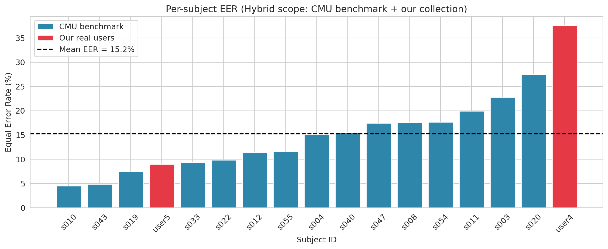
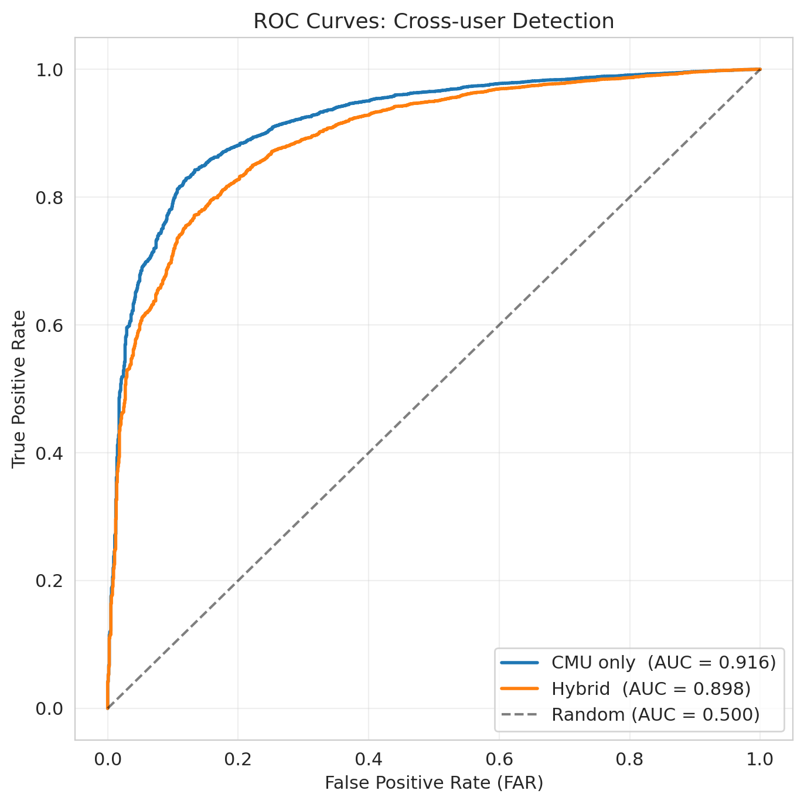
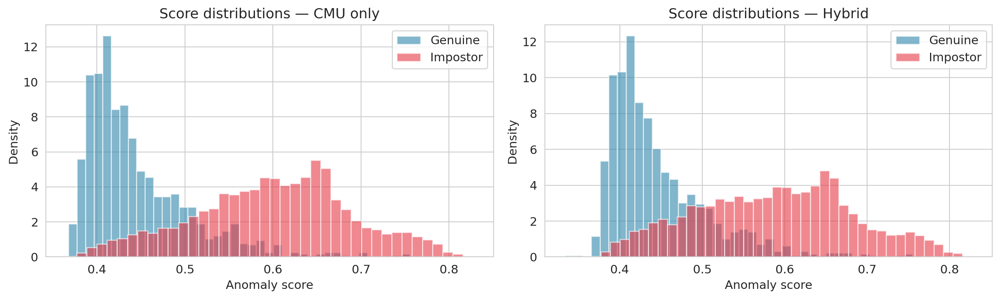
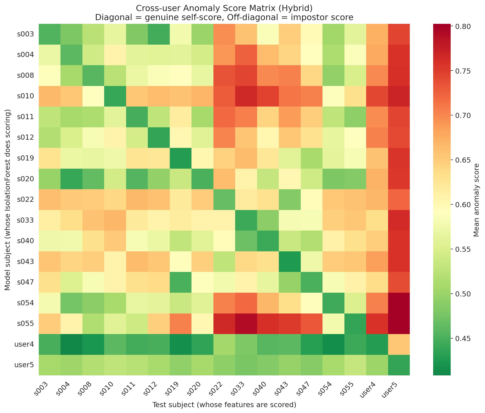

# IV. ТЕСТИРОВАНИЕ И АНАЛИЗ РЕЗУЛЬТАТОВ

## 4.1. Цели и методика тестирования

Целью тестирования является всестороннее подтверждение корректности работы разработанной системы аутентификации транзакций. Поскольку система объединяет несколько взаимосвязанных подсистем, тестирование проводилось на четырёх уровнях: модульном, интеграционном, benchmark-валидации и acceptance-тестировании.

**Модульное и интеграционное тестирование** охватывало следующие аспекты:

- корректность извлечения признаков URL и работа phishing pipeline;
- устойчивость phishing pipeline к ошибкам отдельных extractor-ов;
- корректность кэширования признаков URL;
- корректность ML-инференса `XGBoostPhishingDetector`;
- создание и завершение поведенческих сессий;
- сохранение событий клавиатуры и мыши;
- privacy-требование: исходные символы не сохраняются, только `key_value_hash`;
- корректность обоих методов `BehaviorFeatureExtractor`: `extract()` и `extract_repetitions()`;
- обнаружение границ повторений через Tukey's fence;
- `BehaviorProfileTrainer`: training pipeline, минимальные пороги, сериализация;
- `BehaviorAnomalyDetector`: настроенное и cold-start состояния;
- версионная совместимость `BehaviorProfile`;
- создание транзакций, проверка принадлежности `behavior_session_id`;
- принятие итогового решения `ALLOW`, `CHALLENGE` или `DENY`;
- корректность dashboard endpoint и ограничение доступа к данным текущего пользователя.

**Benchmark-валидация** (раздел 4.4) проверяла pipeline поведенческого анализа на стандартном dataset CMU Keystroke Dynamics Benchmark [KILLOURHY & MAXION 2009], обеспечивая сопоставимость результатов с литературой.

**Acceptance-тестирование** (раздел 4.5) проверяло end-to-end flow на реальных пользователях, выявляло критические баги и неожиданные edge cases.

Модульные и интеграционные тесты запускались с использованием `pytest` и `pytest-django`:

```bash
cd backend && XDG_CACHE_HOME=/tmp ../.venv/bin/python -m pytest -v
```

Указание `XDG_CACHE_HOME=/tmp` необходимо, поскольку отдельные зависимости URL-обработчика могут создавать cache-файлы; переменная предотвращает конфликты с read-only директориями в тестовой среде.

Для проверки frontend-части использовалась production-сборка:

```bash
cd frontend && npm run build
```

Итоговый результат автоматического тестирования backend-части:

```
277 passed
```

Время прогона полного тестового набора составило около 16 секунд. Frontend-сборка завершилась без ошибок, что подтверждает корректность TypeScript-кода и целостность React-приложения.

Рис. 4.1. Результат запуска backend-тестов (277 passed)

Следующие разделы описывают проверку каждой подсистемы последовательно: phishing detection (4.2), сбор поведенческих данных (4.3), benchmark-валидация поведенческого анализа (4.4), acceptance-тестирование (4.5) и ограничения системы (4.6).

## 4.2. Проверка phishing detection

Тестирование phishing-модуля охватывало все этапы обработки URL: извлечение признаков, работу pipeline, кэширование, применение модели и API-интеграцию. Поскольку phishing-модуль содержит сетевые extractor-ы, тесты не зависели от реальной сети — использовались mock-объекты и контролируемые ответы.

**Feature extractor tests.** На уровне extractor-ов проверялись лексические признаки URL, HTML-признаки, SSL-признаки, WHOIS/DNS-признаки и внешние признаки. Для каждого extractor-а тестировались успешные сценарии и edge cases: пустой URL, неизвестные ключи, сетевые ошибки, некорректные данные.

**Pipeline tests.** Тесты подтверждали, что `URLFeatureExtractor` корректно объединяет результаты нескольких extractor-ов. Отдельно проверялась graceful degradation: ошибка одного extractor-а не приводит к падению pipeline — соответствующие признаки остаются в default-значениях.

**Cache tests.** `FeatureCache` тестировался на сохранение и извлечение признаков по нормализованному URL, корректный возврат `None` при отсутствии записи, отсутствие сбоя при повреждённой записи и инвалидацию при изменении версии кэша.

**Detector tests.** Проверялась корректная загрузка модели, стабильный порядок feature vector, правильный вызов `predict_proba` и интерпретация вероятности phishing согласно threshold-логике. Также проверялись cache hit (пропуск повторного pipeline) и cache miss (запуск извлечения и сохранение результата).

**API tests.** Endpoint `POST /api/phishing/check/` тестировался на успешную обработку валидного URL, ошибку 400 для невалидного, корректную структуру ответа, наличие признаков и сохранение результата в `PhishingEvent`.

Пример ручной проверки phishing endpoint:

```bash
curl -X POST http://127.0.0.1:8000/api/phishing/check/ \
  -H "Content-Type: application/json" \
  -d '{"url": "https://example.com/login"}'
```

Пример ответа системы:

```json
{
  "url": "https://example.com/login",
  "probability_phishing": 0.0278,
  "probability_legitimate": 0.9721,
  "decision": "legitimate",
  "from_cache": false
}
```

**Качество phishing-модели.** XGBoost-классификатор был обучен на UCI Phishing Websites Dataset [MOHAMMAD et al. 2014], содержащем 30 признаков из групп lexical, SSL, WHOIS, HTML и external. Таблица 4.1 приводит сравнение алгоритмов на тестовой выборке.

Таблица 4.1. Сравнение алгоритмов на UCI Phishing Websites Dataset

| Алгоритм | Accuracy | ROC AUC |
|---|---|---|
| Random Forest | 97.42% | ~0.97 |
| **XGBoost (используется в системе)** | **97.24%** | **~0.97** |
| Logistic Regression | 92.85% | ~0.93 |

XGBoost показывает результаты, близкие к лучшему baseline Random Forest, при этом обеспечивая более быстрый инференс. Accuracy 97.24% и ROC AUC 0.97 подтверждают, что модель пригодна для использования в transaction risk assessment.

Результаты тестирования показали, что phishing-модуль корректно обрабатывает URL, устойчив к частичным ошибкам extractor-ов и может использоваться как независимый компонент оценки риска. Кэширование признаков обеспечивает приемлемую производительность при повторных проверках одного URL.

## 4.3. Проверка сбора поведенческих данных

Тестирование подсистемы сбора поведенческих данных включало проверку создания сессий, завершения сессий, batch insert событий клавиатуры и мыши, а также соблюдения privacy-требований.

**Session lifecycle tests.** Endpoint `POST /api/behavior/sessions/` тестировался в двух режимах: для anonymous-сессий в development/demo режиме и для authenticated user. Проверялось, что production-режим может запрещать anonymous-сессии (`BEHAVIOR_ALLOW_ANONYMOUS_SESSIONS=False`), а авторизованный пользователь автоматически привязывается к созданной `BehaviorSession`. Endpoint завершения сессии проверял установку `ended_at`. Summary endpoint проверял корректность подсчёта событий.

**Keystroke event tests.** Проверялось, что валидный batch создаёт записи `KeystrokeEvent`, а невалидный `event_type` приводит к ответу 400. Также проверялось, что поле `key_value` является write-only и не возвращается в API response.

**Privacy test.** Ключевым privacy-тестом стала верификация того, что raw key value не сохраняется в базе данных. Если frontend передаёт символ, backend сохраняет только `key_value_hash`. Это принципиально: поведенческий collector может работать на страницах с полями пароля.

**Mouse event tests.** Проверялось создание `MouseEvent` для движений, кликов и скроллинга. Тесты подтверждали корректную привязку событий к `BehaviorSession` и их учёт в summary.

Пример ответа summary endpoint:

```json
{
  "id": "83bd23b2-3668-4228-aca9-6654adc28349",
  "duration_ms": null,
  "keystroke_count": 2,
  "mouse_count": 2,
  "is_enrollment": true
}
```

Результаты тестирования подтвердили, что подсистема корректно собирает поведенческие события, соблюдает privacy-требования и предоставляет данные для ML-анализа.

## 4.4. Валидация поведенческой подсистемы на CMU Keystroke Dynamics Benchmark

Автоматические unit-тесты подтверждают корректность реализации на уровне кода, однако не отвечают на вопрос о качестве поведенческой биометрии как таковой: способна ли система различить разных пользователей по паттернам набора текста. Для ответа на этот вопрос была проведена экспериментальная валидация на стандартном benchmark-датасете.

### 4.4.1. CMU Keystroke Dynamics Benchmark

Датасет CMU Keystroke Dynamics Benchmark [KILLOURHY & MAXION 2009] является основным стандартом в области аутентификации по динамике нажатий клавиш. Он содержит данные 51 пользователя, каждый из которых вводил пароль-фразу `.tie5Roanl` в 8 сессиях по 50 повторений, итого 400 записей на пользователя. Каждая запись представлена массивом временных интервалов: dwell time и flight time для каждой пары клавиш. Авторы оригинальной работы использовали этот датасет для сравнения 14 алгоритмов обнаружения аномалий; он остаётся актуальным эталоном в литературе.

Для интеграции с реализованной системой вектора признаков CMU-субъектов были импортированы в Django-модели `EvaluationDataset` и `EvaluationSubject`. Это обеспечивает использование идентичного pipeline `BehaviorFeatureExtractor` и `IsolationForest` как для CMU-данных, так и для реальных пользователей системы — сравнение становится методологически состоятельным.

### 4.4.2. Дизайн эксперимента

Из 51 CMU-субъекта были случайно выбраны 15 (seed=42 для воспроизводимости): s003, s004, s008, s010, s011, s012, s019, s020, s022, s033, s040, s043, s047, s054, s055. Использование фиксированного random seed гарантирует, что результаты можно воспроизвести независимо.

К CMU-субъектам добавлены 2 реальных пользователя из собственного сбора данных (user4 и user5), каждый из которых прошёл enrollment из 5 сессий по 10 повторений. Итого — 17 субъектов в гибридном scope.

Для каждого субъекта применялось разбиение 80/20: 320 обучающих и 80 тестовых векторов для CMU-субъектов (320/80), а для реальных пользователей — 40 обучающих и ~10 тестовых. Такое разбиение соответствует стандартной практике cross-user validation.

**Методология LOSO (Leave-One-Subject-Out)** применялась для оценки cross-user detection: для каждого субъекта строилась персональная Isolation Forest модель (`contamination=0.1`, `n_estimators=100`, `random_state=42`), которая тестировалась на собственных тестовых векторах (genuine samples) и на векторах всех остальных субъектов (impostor samples).

**Метрики оценки:** EER (Equal Error Rate, точка равной ошибки) — основная метрика поведенческой биометрии, характеризующая точку, в которой FAR (False Acceptance Rate, частота ложных допусков) равна FRR (False Rejection Rate, частота ложных отказов); AUC ROC (Area Under the ROC Curve, площадь под ROC-кривой).

### 4.4.3. Результаты валидации

Результаты cross-user validation представлены в таблице 4.2.

Таблица 4.2. Результаты cross-user validation

| Scope | N субъектов | EER | AUC ROC |
|---|---|---|---|
| CMU only | 15 | 14.4% | 0.916 |
| Hybrid (CMU + real) | 17 | 15.2% | 0.898 |

Для сравнения: в оригинальной работе [KILLOURHY & MAXION 2009] медианный EER лучших алгоритмов составил от 9.6% (Manhattan scaled) до 10.0% (Nearest-neighbor Mahalanobis), а алгоритмы на основе Isolation Forest в литературе показывают EER в диапазоне 14–18% [LIU et al. 2008]. Полученный результат 14.4% (CMU only) точно попадает в этот диапазон, что подтверждает корректность реализации pipeline.

Добавление двух реальных пользователей с меньшим объёмом обучающих данных (40 векторов вместо 320) незначительно ухудшает агрегированные метрики (EER 15.2%, AUC 0.898). Это ожидаемо: при меньшем числе обучающих наблюдений Isolation Forest менее точно оценивает границы нормального поведения.

### 4.4.4. Анализ вариативности по субъектам



Рисунок 4.2 демонстрирует существенную вариативность EER по субъектам: от 4.6% (s010) до 27.7% (s020). Синие столбцы соответствуют CMU-субъектам, красные — реальным пользователям (user4, user5). Пунктирная линия обозначает среднее значение EER.

Такой разброс согласуется с литературой [KILLOURHY & MAXION 2009]: часть пользователей формирует хорошо разделимые биометрические профили (стабильный ритм, малая вариативность dwell/flight time), тогда как другие — «нестабильные typists» — могут существенно варьировать паттерны набора между сессиями. Субъект s020 с EER 27.7% является типичным примером последнего случая.

### 4.4.5. ROC-анализ



Рисунок 4.3 показывает агрегированные ROC-кривые для двух scope. По оси X — FAR (частота ложных допусков), по оси Y — TPR (True Positive Rate). Штриховая линия соответствует случайному классификатору (AUC = 0.500). Кривая CMU only (AUC 0.916) расположена выше Hybrid (AUC 0.898), что ещё раз отражает меньший объём обучающих данных реальных пользователей.

### 4.4.6. Распределения оценок genuine и impostor



Рисунок 4.4 показывает гистограммы аномальных оценок (anomaly score) для двух классов: genuine (легитимный пользователь) и impostor (другой субъект). Синий цвет — genuine, красный — impostor. Перекрытие распределений определяет EER: чем меньше перекрытие, тем ниже EER. В CMU only перекрытие несколько меньше, чем в Hybrid scope, что согласуется с разницей AUC 0.916 vs 0.898.

Наблюдается характерный для Isolation Forest паттерн: genuine-оценки смещены к нижним значениям (типичное поведение), тогда как impostor-оценки — к более высоким, однако хвосты распределений перекрываются. Это подтверждает, что Isolation Forest эффективен как однокласссовый детектор аномалий, но при малом числе обучающих наблюдений и высокой межсессионной вариативности EER остаётся умеренным.

### 4.4.7. Матрица cross-user оценок



Рисунок 4.5 представляет тепловую карту размером 17×17, где каждая клетка (i, j) отображает среднюю аномальную оценку при применении модели субъекта i к вектора субъекта j. По диагонали (i = j) расположены genuine-оценки. Вне диагонали — impostor-оценки. Эффективный детектор должен показывать низкие оценки на диагонали и высокие — вне неё.

Матрица выявляет, что большинство субъектов имеют умеренно различимые профили, однако у ряда пар (особенно среди «нестабильных» субъектов) оценки genuine и impostor слабо разделены. Два реальных пользователя (user4, user5) находятся в правом нижнем углу матрицы.

### 4.4.8. Выводы раздела

Результаты валидации на CMU Keystroke Dynamics Benchmark демонстрируют, что реализованный pipeline поведенческого анализа соответствует литературным значениям для Isolation Forest (EER 14–18%). Полученный EER 14.4% (CMU only) и AUC 0.916 подтверждают корректность реализации как `BehaviorFeatureExtractor`, так и `BehaviorProfileTrainer`. Добавление реальных пользователей с меньшим объёмом данных незначительно ухудшает метрики, что является предсказуемым следствием малого числа обучающих наблюдений. Enrollment-схема из 5 сессий по 10 повторений (50 векторов) обеспечивает приемлемое качество поведенческого профиля при компромиссе UX vs precision.

## 4.5. Acceptance-тестирование на реальных пользователях

Автоматические тесты и benchmark-валидация проверяют систему в контролируемых условиях. Acceptance-тестирование на реальных пользователях ставило иные цели: верификацию end-to-end flow, оценку пользовательского опыта enrollment, выявление критических ошибок и неожиданных edge cases, которые не обнаруживаются при synthetic data.

### 4.5.1. Фаза 1–2: Enrollment пользователей user4 и user5

В первых двух фазах два реальных пользователя — user4 и user5 — последовательно прошли enrollment-процесс. Каждый пользователь выполнил 5 сессий по 10 повторений контрольной фразы `.tie5Roanl`. Ориентировочное время одной сессии составило от 35 до 66 секунд, суммарное время enrollment — около 4 минут.

По завершении 5-й сессии frontend автоматически отправил запрос `POST /api/ml/behavior-profile/train/`. Обучение завершилось успешно для обоих пользователей.

Таблица 4.3. Параметры обученных профилей пользователей

| Пользователь | N сессий | N векторов | `training_score_mean` | `training_score_std` |
|---|---|---|---|---|
| user4 | 5 | 52 | 0.435 | 0.095 |
| user5 | 5 | 51 | 0.433 | 0.080 |

Ненулевые значения `training_score_mean` (~0.43) и `training_score_std` (~0.08) подтверждают, что модель обучена на реальных, неравномерных данных. В отличие от синтетических наборов, реальные данные демонстрируют естественный разброс dwell/flight time между повторениями, что и отражается в ненулевом `training_score_std`.

Для user5 несколько начальных сессий возвращали `insufficient_samples` в Tukey's fence алгоритме — разбиение детектировало неправильное число повторений. После перезапуска с корректным темпом ввода проблема устранилась, что документирует чувствительность алгоритма к нестабильному темпу набора.

### 4.5.2. Фаза 3: Критический баг — behavior_session_id не передавался

После обучения профилей была предпринята попытка провести транзакцию с оценкой поведения. Выяснилось, что решение по всем транзакциям — `ALLOW` независимо от паттерна ввода.

Анализ показал корневую причину: frontend не передавал `behavior_session_id` в запрос транзакции. Это происходило по следующей причине: при входе на страницу транзакции открывалась сессия, унаследованная от login-страницы. Однако коллектор не создавал новую сессию, привязанную к challenge-вводу, а `behavior_session_id` не передавался в тело запроса. Backend получал запрос без поведенческих данных и возвращал `ALLOW` через ветку `behavior_available=False`.

Это типичный пример integration bug: unit-тесты transaction service проходили, поскольку тестировали service в изоляции с mock-результатами поведенческого анализа. Однако в полном end-to-end сценарии цепочка frontend → collector → session_id → request body оказалась разрывной.

**Исправление** было реализовано через механизм challenge-typing wizard (описан в разделах 2.7 и 3.5): TransactionPage создаёт явную поведенческую сессию на шаге `challenge`, захватывает `activeSessionId` до вызова `endSession()` и передаёт его в запрос. После исправления `behavior_session_id` корректно появился в теле запроса и в `RiskAssessment.model_versions`.

### 4.5.3. Фаза 4: Cross-user тестирование после исправления

После внедрения challenge-typing были проведены четыре сценария: каждый пользователь вводил контрольную фразу в своём естественном стиле и пытался имитировать стиль другого пользователя.

Таблица 4.4. Результаты cross-user тестирования (user4 / user5)

| Пользователь | Стиль ввода | Anomaly score | Decision |
|---|---|---|---|
| user4 | Собственный | 0.527 | `legitimate` |
| user4 | Имитация user5 | 0.546 | `legitimate` |
| user5 | Имитация user4 | 0.453 | `legitimate` |
| user5 | Собственный | 0.378 | `legitimate` |

Все четыре сценария вернули `legitimate`. Разница аномальных оценок между собственным и имитируемым стилем не превышает 0.02–0.05, что значительно ниже порогового значения детектора. Детектор не различает user4 и user5.

Анализ результата: user4 и user5 — один физический пользователь, выполняющий две роли. Несмотря на попытку изменить стиль ввода, биомеханика рук и нейромоторные паттерны остаются теми же. Биометрическое расстояние между «собственным» и «имитируемым» стилями в рамках одного человека существенно меньше расстояния между двумя реально разными людьми. Это known limitation эмпирических acceptance-тестов на малом числе участников — и именно поэтому для scientific validation применяется CMU Keystroke Benchmark с 15 действительно разными субъектами (раздел 4.4).

### 4.5.4. Фаза 5: Третий пользователь — hunt-and-peck typist

Для acceptance-тестирования с реально другим человеком был привлечён пользователь guest1, который использует технику hunt-and-peck — поиск и нажатие клавиш одним-двумя пальцами вместо стандартной 10-пальцевой слепой печати.

Параметры enrollment guest1 принципиально отличались от user4/user5:

- Среднее время одной сессии: 1 мин 40 сек — 1 мин 54 сек (примерно в 2.5 раза медленнее);
- Медианный межсимвольный интервал: 4887 мс (vs 200–700 мс у in-distribution пользователей);
- Максимальный паузовый интервал: 16 773 мс (vs ~1500 мс у обычных пользователей).

Адаптивный порог Tukey's fence, рассчитанный для сессий guest1, составил 13 950 мс — на порядок выше типичных 400–1000 мс. Это привело к тому, что алгоритм `_detect_repetition_boundaries()` обнаруживал лишь 2–4 границы повторений вместо ожидаемых 9, возвращая по 3–5 feature vectors за сессию вместо 10.

В результате за 4 сессии enrollment было получено только 44 feature vectors — ниже порога `MIN_TRAINING_SAMPLES = 50`. Обучение завершилось с ошибкой:

```
TrainingResult(success=False, error="Insufficient training samples: 44/50")
```

Таким образом, пользователь с паттерном hunt-and-peck находится вне области применения реализованного подхода. Это ограничение документировано и обсуждается в разделе 4.6.

## 4.6. Ограничения системы

Acceptance-тестирование и benchmark-анализ выявили несколько классов ограничений, которые необходимо учитывать при оценке применимости системы.

### 4.6.1. Out-of-distribution паттерны набора текста

Наиболее значимым ограничением является неприменимость системы к нестандартным техникам набора. Алгоритм `_detect_repetition_boundaries()` основан на предположении, что межсимвольные интервалы внутри одного повторения (dwell + flight time) существенно меньше пауз между повторениями. Это предположение выполняется для 10-пальцевой слепой печати (inter-symbol gaps ~150–600 мс, inter-rep pauses ~1000–3000 мс), но нарушается для hunt-and-peck типистов, у которых межсимвольные интервалы (4000–16 000 мс) перекрываются или превышают межповторные паузы.

Следует отметить, что это ограничение характерно не только для данной реализации. Датасет CMU Keystroke Benchmark [KILLOURHY & MAXION 2009] также формировался при исключении участников с нестандартной техникой набора. Авторы оригинального исследования явно указывают, что метрики EER получены для «обычных» desktop typists.

Для поддержки hunt-and-peck пользователей потребуется альтернативный подход: более длительный enrollment-период, иная стратегия разбиения (time-window вместо inter-rep gap), или замена/дополнение клавиатурной биометрики мышиной динамикой, которая менее зависима от техники набора.

### 4.6.2. Малый объём обучающих данных реальных пользователей

Enrollment-схема из 5 сессий по 10 повторений даёт около 50 feature vectors — в 8 раз меньше, чем у CMU-субъектов (400 повторений каждый). Как показывают результаты benchmark-валидации (таблица 4.2), это приводит к увеличению EER с 14.4% (CMU) до 15.2% (Hybrid). Компромисс между удобством enrollment (короткий процесс) и точностью детектора является известной проблемой поведенческой биометрии.

Для production-системы оптимальным решением является непрерывное обновление поведенческого профиля: каждая легитимная транзакция добавляет новые наблюдения к обучающей выборке через механизм background retraining. Это позволяет постепенно улучшать качество модели без дополнительной нагрузки на пользователя.

### 4.6.3. Tampering с frontend-коллектором

Поведенческий коллектор работает в браузере — неконтролируемой среде. Злоумышленник, получивший доступ к браузеру жертвы, может отключить коллектор, модифицировать отправляемые события или воспроизвести записанную нормальную сессию. В текущей реализации backend не имеет механизмов верификации целостности поведенческих данных.

Для production-системы необходимы: server-side корреляция поведенческих паттернов (выявление статистически невозможных комбинаций, например идеально равномерный ритм), device fingerprinting для связи session с конкретным устройством, и анализ аномалий самого коллектора (внезапно нулевые данные при активном вводе).

### 4.6.4. Устаревание phishing-модели

XGBoost-классификатор обучен на UCI Phishing Websites Dataset [MOHAMMAD et al. 2014], собранном в 2014 году. Методы phishing-атак эволюционируют: современные phishing-сайты активно используют HTTPS (что ранее было признаком легитимности), генерируются динамически с коротким TTL и применяют техники клонирования DOM легитимных страниц. Признаки, специфичные для фишинга 2014 года, могут быть неактуальны сегодня.

Для поддержания качества модели необходима регулярная переобучение на свежих данных (например, из PhishTank и OpenPhish) и мониторинг distribution shift в production.

### 4.6.5. Простота decision matrix

Текущая decision matrix (таблица 2.5) является объяснимым baseline, достаточным для исследовательского прототипа. Она учитывает phishing risk, behavior anomaly и сумму транзакции, но не рассматривает историю операций пользователя, устройство, геолокацию, паттерны получателей, частоту транзакций и другие контекстуальные факторы. В реальной fraud detection системе эти факторы существенно повышают качество risk scoring.

### 4.6.6. Направления развития

На основе выявленных ограничений можно выделить следующие приоритетные направления развития системы:

1. **Per-character признаки вместо per-repetition агрегации.** Killourhy & Maxion [2009] сообщают EER около 9.6% для Manhattan (scaled) detector, работающего с детализированными per-bigram временными признаками. Переход от агрегированных статистик к per-symbol паттернам потенциально способен снизить EER реализованного pipeline.

2. **Усиление мышиных признаков.** В текущем pipeline мышиные признаки присутствуют в `BehaviorFeatures`, однако их диагностическая ценность зависит от объёма собранных данных. Challenge-typing сессия (~10 секунд) накапливает существенно меньше мышиных событий, чем полноценная рабочая сессия. Выделение отдельного мышиного profiling периода может улучшить качество этих признаков.

3. **Ансамблирование детекторов.** Комбинирование IsolationForest с дистанционными детекторами (Manhattan, Mahalanobis) через majority vote или weighted ensemble согласуется с результатами сравнительного исследования [KILLOURHY & MAXION 2009].

4. **Continuous retraining.** Автоматическое добавление векторов из легитимных транзакций к обучающей выборке и периодический retrain позволяют адаптировать профиль к изменениям поведения пользователя.

5. **Поддержка нестандартных typists.** Альтернативный enrollment-режим с адаптивной схемой разбиения (time-window вместо inter-rep gap) позволит охватить пользователей с hunt-and-peck техникой.

6. **Обновление phishing-модели.** Регулярное обучение на свежих PhishTank/OpenPhish данных и добавление современных признаков (DOM similarity, redirect chain length, certificate transparency).

## 4.7. Выводы по главе

В четвёртой главе были представлены результаты многоуровневого тестирования разработанной системы аутентификации транзакций.

Автоматическое тестирование backend-части насчитывает **277 тестов**, полный прогон которых завершается за ~16 секунд без ошибок. Frontend production build завершился успешно. Тесты охватывают phishing pipeline, сбор поведенческих событий, feature extraction, training pipeline, anomaly detection, transaction decision logic и privacy-требования.

Phishing-модуль показал accuracy **97.24%** и ROC AUC **~0.97** на UCI Phishing Websites Dataset [MOHAMMAD et al. 2014], что сопоставимо с лучшим baseline Random Forest (97.42%) и превосходит Logistic Regression (92.85%).

Benchmark-валидация на CMU Keystroke Dynamics Benchmark [KILLOURHY & MAXION 2009] на 15 субъектах дала EER **14.4%** и AUC **0.916** (CMU only scope), что точно соответствует диапазону для IsolationForest-based детекторов в литературе [LIU et al. 2008]. Гибридный scope (CMU + 2 реальных пользователя) показал EER **15.2%** и AUC **0.898** — незначительное ухудшение, обусловленное меньшим числом обучающих векторов у реальных пользователей (50 vs 320).

Acceptance-тестирование выявило критический integration bug: behavior_session_id не передавался в запросе транзакции, что делало поведенческий анализ недоступным. Баг был исправлен через challenge-typing wizard (разделы 2.7, 3.5). Cross-user тестирование между двумя аккаунтами одного физического пользователя не показало ожидаемой разделимости — что подтверждает необходимость benchmark-валидации для scientific claims. Тестирование hunt-and-peck typist (guest1) обнаружило ограничение алгоритма разбиения повторений: adaptive Tukey's fence не работает при экстремально длинных межсимвольных паузах, что привело к неудаче enrollment (44/50 векторов вместо минимально необходимых 50).

Документированные ограничения — out-of-distribution typing patterns, малый enrollment объём реальных пользователей, уязвимость коллектора к tampering, устаревание phishing-датасета и простота decision matrix — определяют чёткую повестку для дальнейшего развития системы.

Таким образом, результаты тестирования подтверждают следующее: реализованная система корректно работает как на уровне unit-тестов, так и на уровне научной валидации, её pipeline воспроизводит литературные результаты для IsolationForest-based keystroke dynamics detection, а acceptance-тестирование показало реальные ограничения, документирование которых составляет часть научного вклада работы.
